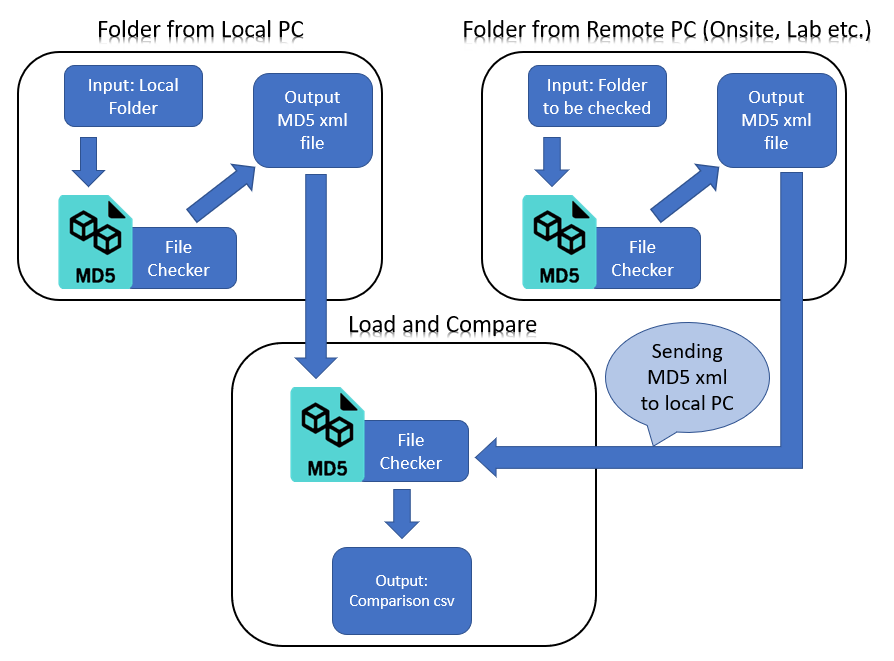
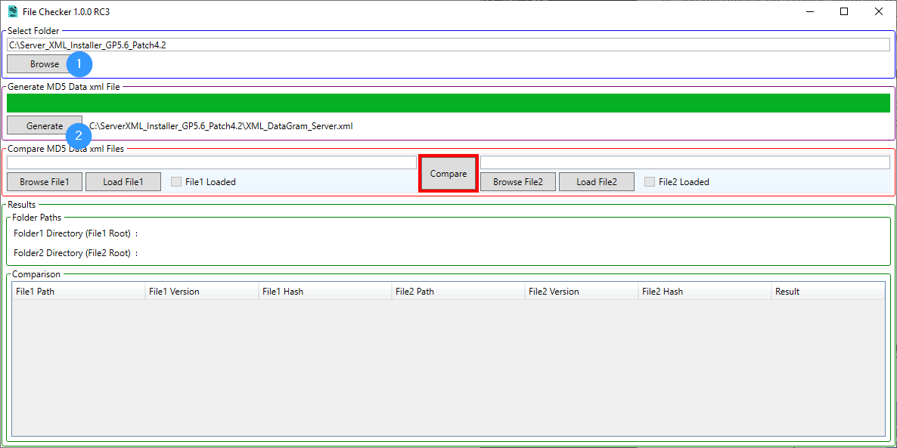
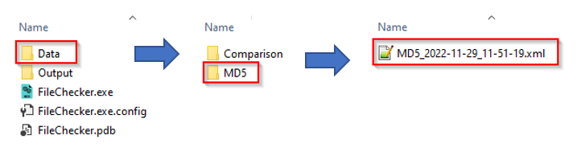
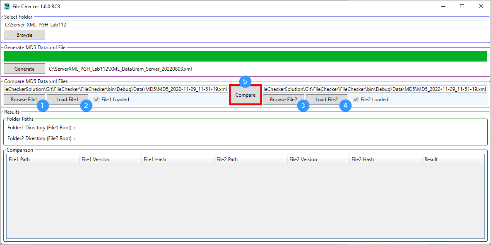
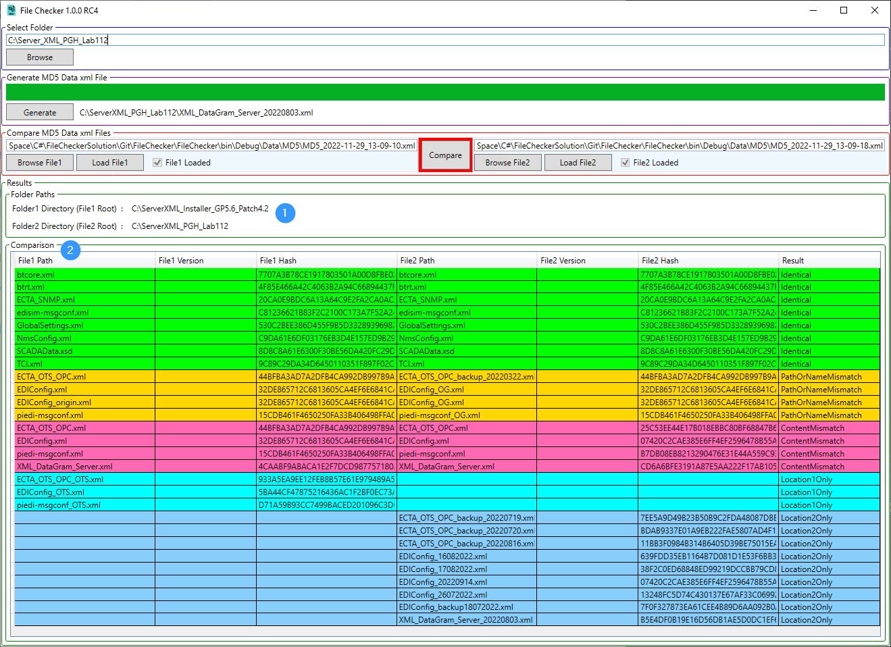
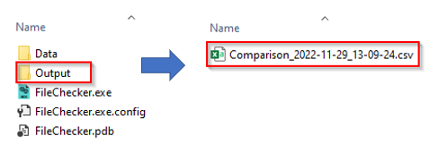

# File Checker
This software is able to compare all the files in two different folders by using the MD5 hash. One major use is when the folders are in two different locations. Let's assume that one is on a local PC and the other is on a remote PC. Normally, to compare two folders, we have to copy the remote folder to the local PC. If the folder size is large, depending on the quality of the internet connection, this process may take a long time.

### So how does File Checker help in this case?
First, we installed "File Checker" software in both locations and generated MD5 XML summary files for both folders. Then we can load them into local "File Checker" software and get the results. This may take only a couple of seconds. (Because "File Checker" is lightweight, installing it on a remote machine takes only seconds; simply copying "FileChecker.exe" is sufficient.)

## Software 
### Generate MD5 xml file for a folder
1. Click "Browse" and select the folder.
2. Click "Generate" (the progress bar will show the working progress).

### MD5 xml file saved location
The file name follows the format "MD5_yyyy-MM-dd_HH-mm-ss."

### Compare two MD5 xml files
After generating two MD5 XML files, we can next compare them.
1. Click "Browse File1" and select the first MD5 XML file.
2. Click "Load File1" to validate the first XML file (the "File1 Loaded" checkbox will be marked if validation is successful).
3. Click "Browse File2" and select the second MD5 XML file.
4. Click "Load File2" to validate the second XML file (the "File2 Loaded" checkbox will be marked if validation is successful).
5. Click "Compare", then it will create the Output and Results section and populate it.

### Results table 
1. Paths of the original folders
2. There are 5 types of results.
   - Identical - files with the same hash code and relative paths
   - PathOrNameMismatch - files with the same hash code but different relative paths
   - ContentMismatch - files with identical relative paths but distinct hash codes
   - Location1Only - hash code and relative path are only available in the first folder
   - Location2Only - hash code and relative path are only available in the second folder

### Results file saved location
Results are saved in CSV format, making it convenient to open via Microsoft Excel.    
The file name follows the format "Comparison_yyyy-MM-dd_HH-mm-ss."   

